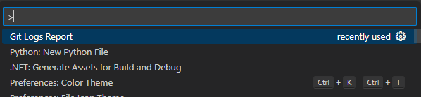
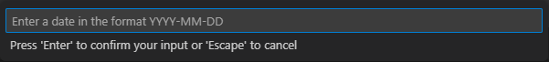
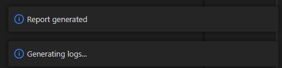
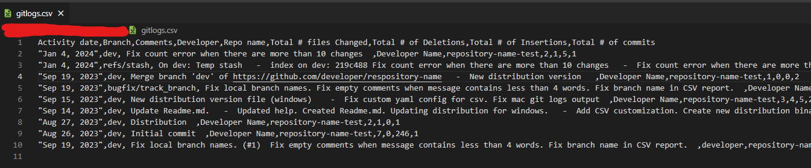

# git-logs-extension README

Generate the logs for all the developers. Use a default yml file to configurate the output.

## Features

Generate the logs for the workspace folders.

For example:

The date can be any value defined in [git documentation](https://git-scm.com/docs/git-log#Documentation/git-log.txt---sinceltdategt)

## Requirements

Install python and git.

As optional you may use some extensions to make easier to read CSV files.

## Extension Settings

Default author: if this value is set, the git logs will be filter by this value. If not, the logs will be generated for all the developers.

Default since: this value is to help to fill the prompt.

## Known Issues

## Release Notes

See [CHANGELOG.md](CHANGELOG.md)
